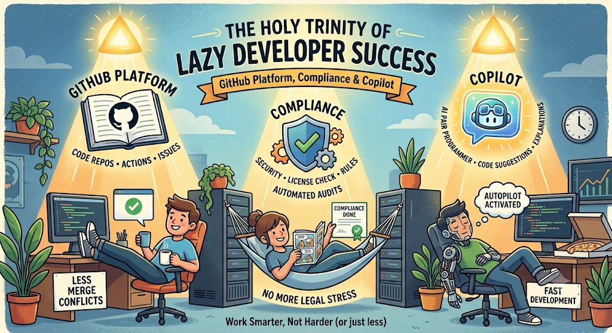

# The Holy Trinity of Lazy Developer Success

## GitHub: Platform, Compliance & Copilot

# About

This repository contains two self-service workflows for participants of the **DevOpsDays Graz 2026**.

# Resources

| Workflow                                               | Description |
|--------------------------------------------------------| --- |
| `.github/workflows/add-external-contributor.yml`       | Used to onboard a new user as external collaborator to the organization. |
| `.github/workflows/create-repository-self-service.yml` | Issue driven workflow, used to create a new repository from a technology template (Docker, Maven,...). |

# Usage

Usage
1. Open an Issue via the [Issue UI](https://github.com/EBCONT-Conference/devopsdays.demo.self-service/issues).
2. Choose the workflow you want to trigger ("User Onboarding" or "Create Repository")
3. Fill out the required information in the issue template and submit the issue.

# Contacts

| Name | Contact      |
| --- | --------------|
| Aleksei Zubkov | aleksei.zubkov@ebcont.com |
| Andreas Titz | andreas.titz@ebcont.com |

 

